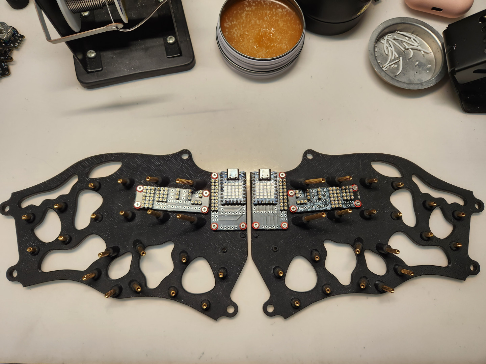
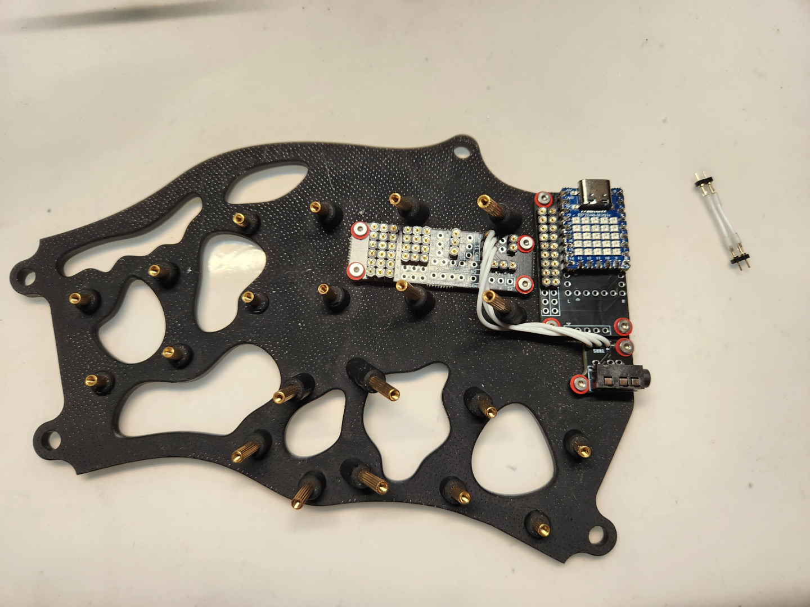
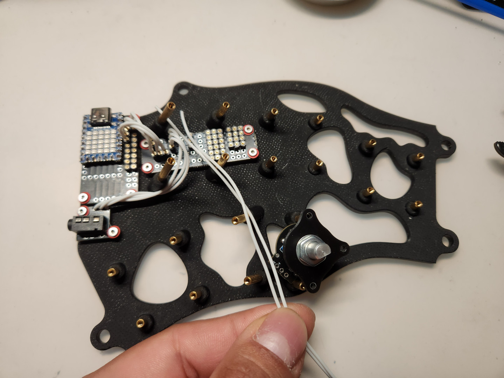
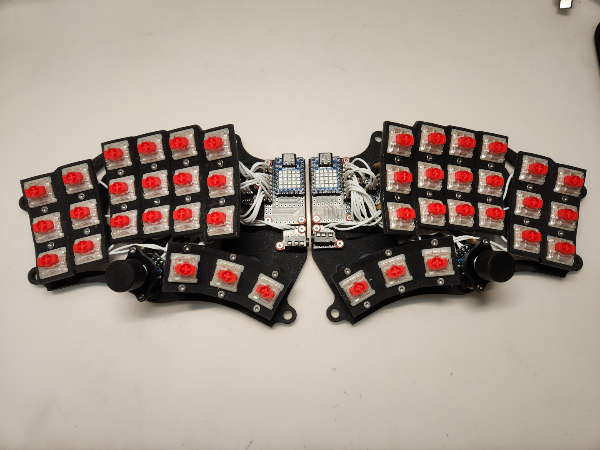

# 組裝說明

- 中文說明（Chinese Guide）。
- [英文說明（English Guide）](guide_en.md)。

## 前置作業

- 列印完所有鍵盤需要的部件後，首先將底板及銅柱拿出來，並依照照片指示將銅柱安裝到適當的位置上。

- 接著將鍵軸安裝到定位板上，完成後再將它們暫時放一邊。

## 二極體及單格電路板

- 這裡簡單說明單格電路板上的二極體方向，請按照下圖將二極體安裝到單格電路板上。

- 接著將二極體用焊錫固定好，再剪去多餘的腳。

- 再來將已經完工的單格電路板安裝到定位板上焊接固定。

- EC-11電路板上還有一個按鈕，不要忘記將二極體接上去。

- 接好二極體後，可以先將旋鈕固定在板子上備著。

## 連結矩陣

- 下圖是MagWave44的矩陣圖，由於定位板合計分成6塊，首先我們需要將圖中的單格電路板用電線接起來。

- 完成後會是這樣的感覺。

## 電路板

> **Note**
>
> 主體電路板的部分包含`MCU`、`本體`、`TRRS`、`EC-11`，請先將他們備著。

- MCU電路板的部分因為它沒有分正反面，你可以任意調整方向，這次是安裝分離式鍵盤，匯流排線接口的部分分別朝向左右邊。

- 接著將MCU（這裡我是使用`RP2040-Matrix`做為主控）按照理想的方式固定在MCU電路板上。

- 接著再將`TRRS座`也焊接固定在專用的PCB板上。

> **Note**
>
> MCU左右邊有幾個可使用的IOPin，就焊接多少母排針座到匯流排線座的標示上。

> **Note**
>
> 下圖是本體電路板的主要功能說明，MagWave44會用到`Power`、`TRRS`（`VCC`、`S1`、`GND`）、`Signal`（`S1`、`A1`、`B1`）、`Rotray Encoder`（`A1`、`GND`、`B1`）及`Matrix`（`Row`及`Col`）的部分，並將左右邊本體電路板相應的排針母座焊接固定好。

- 然後將它們分別用`M2x8mm螺絲`、`M2螺帽`固定在底板上。（這裡我有搭配`墊片`，可視需求使用）

## 接線原理

> **Note**
>
> 如果是想依照MagWave44`相應的韌體`進行接線的話，下圖會說明各類MCU要如何接線比較輕鬆容易：

|微控制器|示意圖|
|---|---|
|`ATMega32U4 ProMicro`、`Elite-C`||
|`RP2040 ProMicro`系列||
|`RP2040-Zero`、`RP2040Supermini`、`RP2040-Matrix `||

> **Warning**
>
> `ProMicro`、`Elite-C`有著相同的IOPin；`RP2040-Zero`、`RP2040Supermini`、`RP2040-Matrix `三者也一樣。

> **Note**
>
> 接著按照順序將MCU上的線路接到本體板上，再將本體向外接線接出去。
> 
> 請依照自己的手拉線技巧將線路一步步接起來，我的方式是將電線組合成排線，再將它們接到相應的位置上。

- 連結TRRS座:

- 給鍵盤本體供電:

- 連結MCU到Signal，還有旋鈕EC-11: （我忘了拍照...）

- EC-11旋鈕的矩陣圖:

- 小指區域的矩陣圖:

- 拇指區域的矩陣位置:

- 最後將主要按鍵區域裝上去:

- 然後完成另一支手：

- 接著測試鍵盤按鍵、矩陣及旋鈕有沒有正常運作。

- 最後把鍵帽安裝上去就完成了。

## 鍵盤腳撐

> **Note**
>
> MagWave44有2種方式自行添加不同角度的腳撐，一種是是M5螺絲安裝在鍵盤周圍的4個角落，一種是使用Magsafe引磁片，需要搭配Magsafe雲台座合併使用。

- Magsafe引磁片：

- M5螺絲腳撐

- Magsafe雲台座，搭配雲台配件使用：

