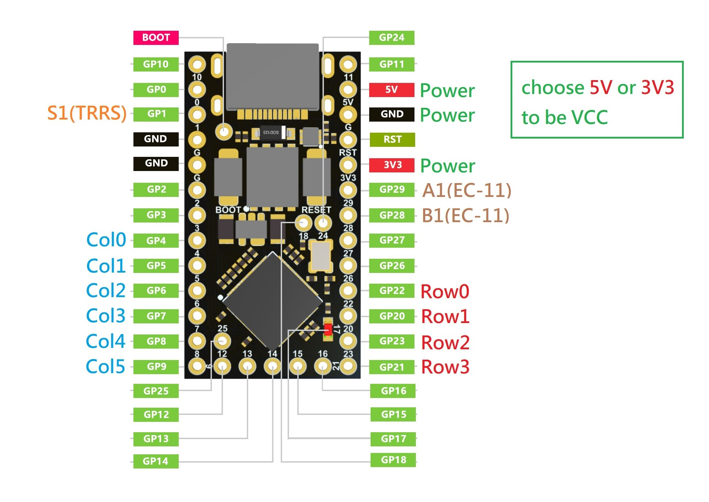

# 組裝說明

- 中文說明（Chinese Guide）。
- [英文說明（English Guide）](guide_en.md)。

## 前置作業

- 列印完所有鍵盤需要的部件後，首先將底板及銅柱拿出來，並依照照片指示將銅柱安裝到適當的位置上。

- 接著將鍵軸安裝到定位板上，完成後再將它們暫時放一邊。

## 二極體及單格電路板

- 這裡簡單說明單格電路板上的二極體方向，請按照下圖將二極體安裝到單格電路板上。

- 接著將二極體用焊錫固定好，再剪去多餘的腳。

- 再來將已經完工的單格電路板安裝到定位板上焊接固定。

- EC-11電路板上還有一個按鈕，不要忘記將二極體接上去。

- 接好二極體後，可以先將旋鈕固定在板子上備著。

## 連結矩陣

- 下圖是MagWave44的矩陣圖，由於定位板合計分成6塊，首先我們需要將圖中的單格電路板用電線接起來。

- 完成後會是這樣的感覺。

## 電路板

> **Note**
>
> 主體電路板的部分包含MCU、本體、TRRS、EC-11，請先將他們備著。

- MCU電路板的部分因為它沒有分正反面，你可以任意調整方向，這次是安裝分離式鍵盤，匯流排線接口的部分分別朝向左右邊。

- 接著將MCU（這裡我是使用RP2040-Matrix做為主控）按照理想的方式固定在MCU電路板上。

- 接著再將TRRS座也焊接固定在專用的PCB板上。

> **Note**
>
> MCU左右邊有幾個可使用的IOPin，就焊接多少母排針座到匯流排線座的標示上。

> **Note**
>
> 下圖是本體電路板的主要功能說明，MagWave44會用到Power、TRRS（VCC、S1、GND）、Signal（S1、A1、B1）、Rotray Encoder（A1、GND、B1）及Matrix（Row及Col）的部分，並將左右邊本體電路板相應的排針母座焊接固定好。

- Then fasten them to the bottom case with M2x8mm screws and M2 nuts respectively. (Here I have the matching washers, you can use it according to your needs)

## Wiring Principle

> **Note**
>
> If you want to wire the MCUs according to the MagWave44 firmware, the following photo shows how to wire the MCUs in an easy way:

1. ATMega32U4 ProMicro, Elite-C:

2. RP2040 ProMicro series:

3. RP2040-Zero, RP2040Supermini, RP2040-Matrix (Matrix RPG supported on board):

