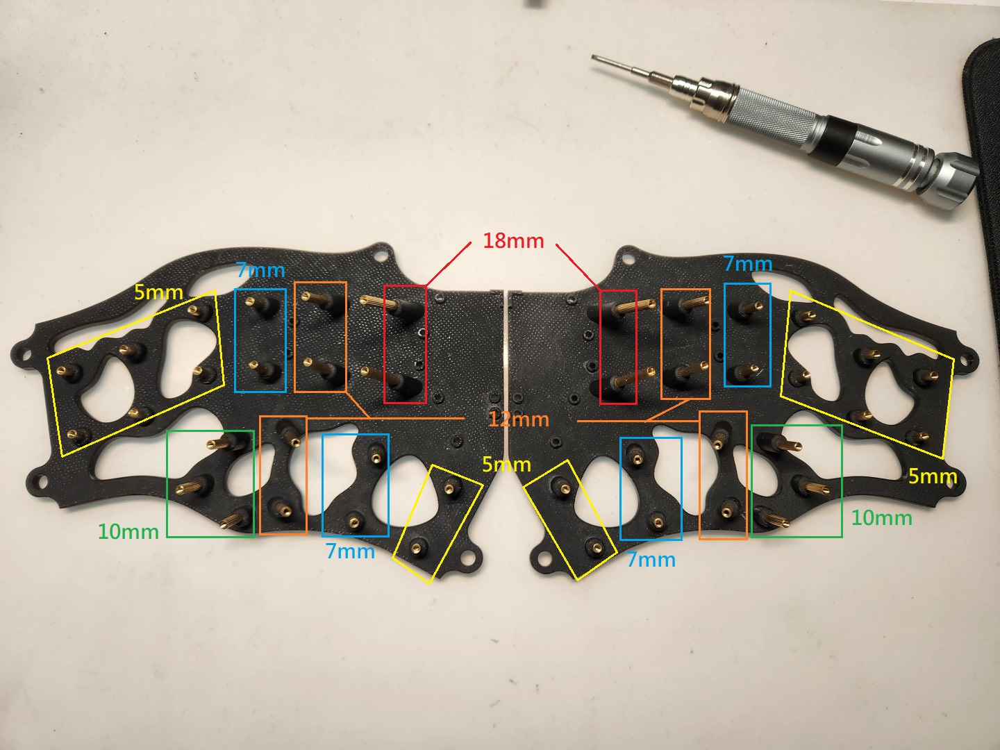
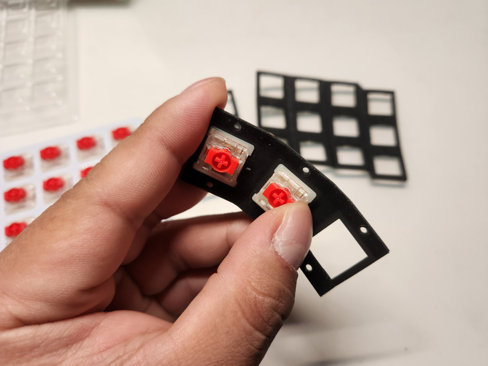

# Building Guide

- [中文說明（Chinese Guide）](guide.md)。
- 英文說明（English Guide）。

## Pre-operation

- After printing out all the parts needed for the keyboard, first take out the bottom parts and spacers ,follow the photo instructions for installing the posts in their proper locations.

- Next, install the switches onto the plate and set them aside temporarily when you are done.

## Diodes and Single PCB

- Here is a brief explanation of the orientation of the diode on the single PCB, please follow the diagram below to install the diode on the PCBs.

- Next step you need to solder the diodes, then cut off the useless feets.

- The completed single PCBs are then mounted onto the positioning plate and soldered in place.

## Link Keyboard Matrix

- The following photo shows the matrix of the Mag-Wave 44. Since all the plates are divided into 6 pieces, first we need to connect the single PCBs in the photo with wires.

- That's how it feels when it's done.

