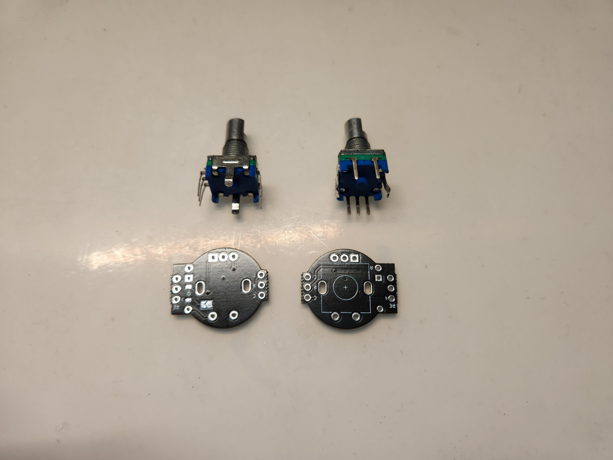
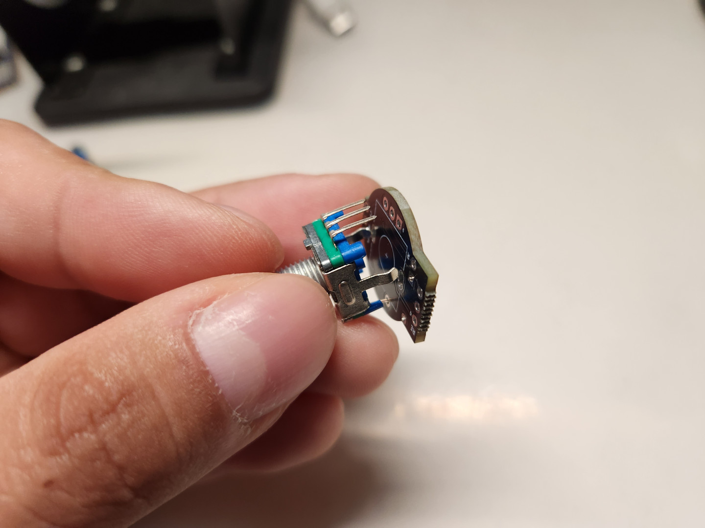
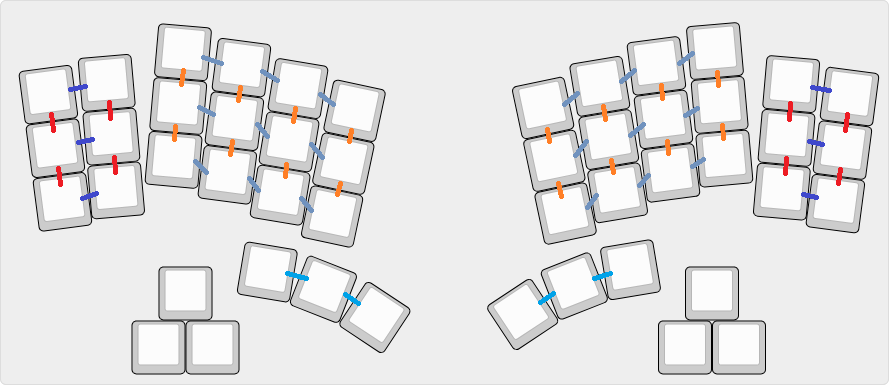
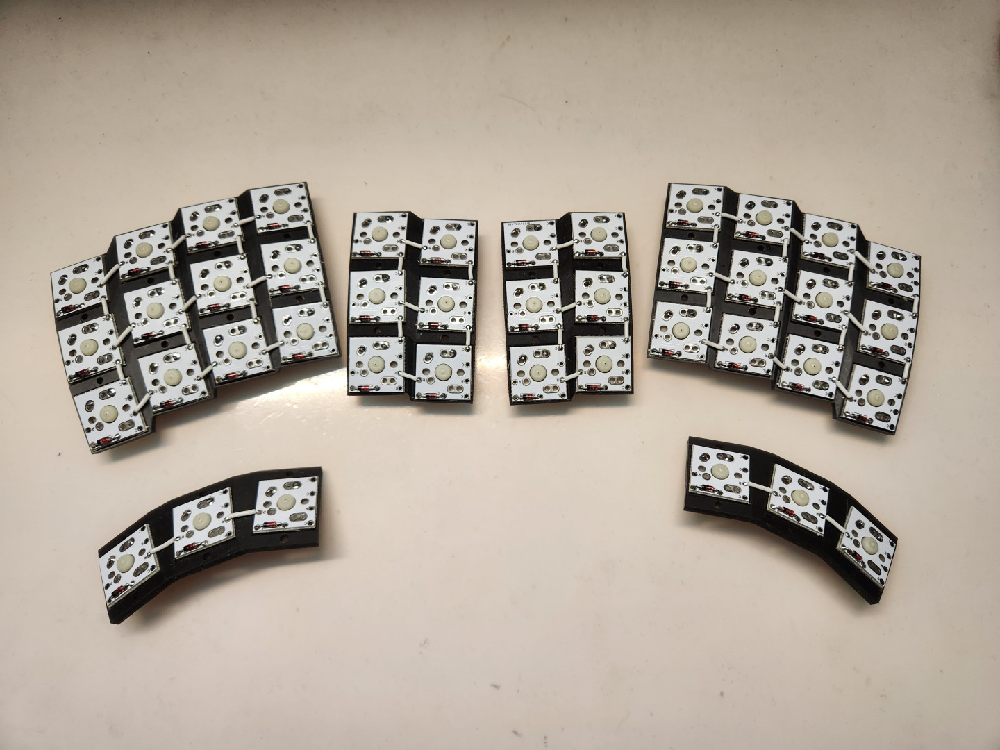
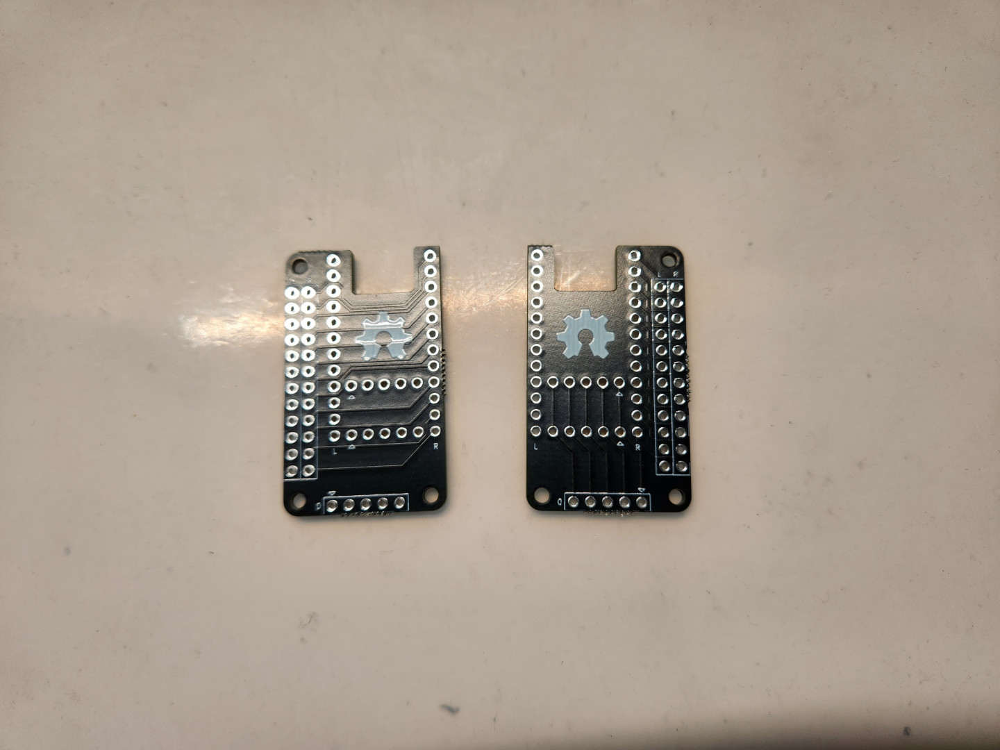
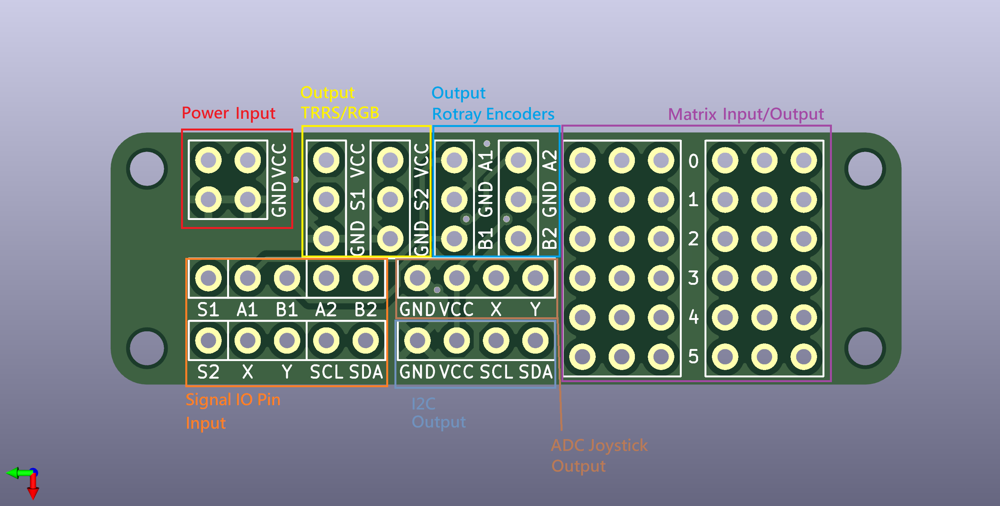

# Building Guide

- [中文說明（Chinese Guide）](guide.md)。
- 英文說明（English Guide）。

## Pre-operation

- After printing out all the parts needed for the keyboard, first take out the bottom parts and spacers ,follow the photo instructions for installing the posts in their proper locations.

- Next, install the switches onto the plate and set them aside temporarily when you are done.

## Diodes and Single PCB

- Here is a brief explanation of the orientation of the diode on the single PCB, please follow the photo below to install the diode on the PCBs.

- Next step you need to solder the diodes, then cut off the useless feets.

- The completed single PCBs are then mounted onto the positioning plate and soldered in place.

- It has a switche on the PCB for EC-11, don't forget to install the diode on it.

- After installing the diode, you can fix the knob on the board first.

## Link Keyboard Matrix

- The following photo shows the matrix of the MagWave44. Since all the plates are divided into 6 pieces, first we need to connect the single PCBs in the photo with wires.

- That's how it feels when it's done.

## PCBs

> **Note**
>
> The part of the main board contains MCU, Body, EC-11 and TRRS, please prepare them first.

- The MCU board part is not divided into front and back, you can adjust the direction, this time it is to install a split keyboard, the part of the bus connector is facing the left and right side respectively.

- Next, solder the MCU (here I used RP2040-matrix to be MCU) on the MCU board in the desired way.

- The TRRS jacks are then soldered to the dedicated PCB board.

> **Note**
>
> The left and right sides of the MCU have several usable IOPins, so solder as many female pins as you want to the bus connector labeled.

> **Note**
>
> The following photo shows the main functions of the board, MagWave44 will use Power, TRRS (VCC, S1, GND), Signal (S1, A1, B1), Rotray Encoder (A1, GND, B1), and Matrix (Row and Col), and will be left and right side of the board the corresponding row of pins female sockets soldering fixed.

- 然後將它們分別用M2x8mm螺絲、M2螺帽固定在底板上。（這裡我有搭配墊片，可視需求使用）

## 接線原理

> **Note**
>
> 如果是想依照MagWave44相應的韌體進行接線的話，下圖會說明各類MCU要如何接線比較輕鬆容易：

1. ATMega32U4 ProMicro, Elite-C:

2. RP2040 ProMicro系列:

3. RP2040-Zero, RP2040Supermini, RP2040-Matrix (板載RPG矩陣):

