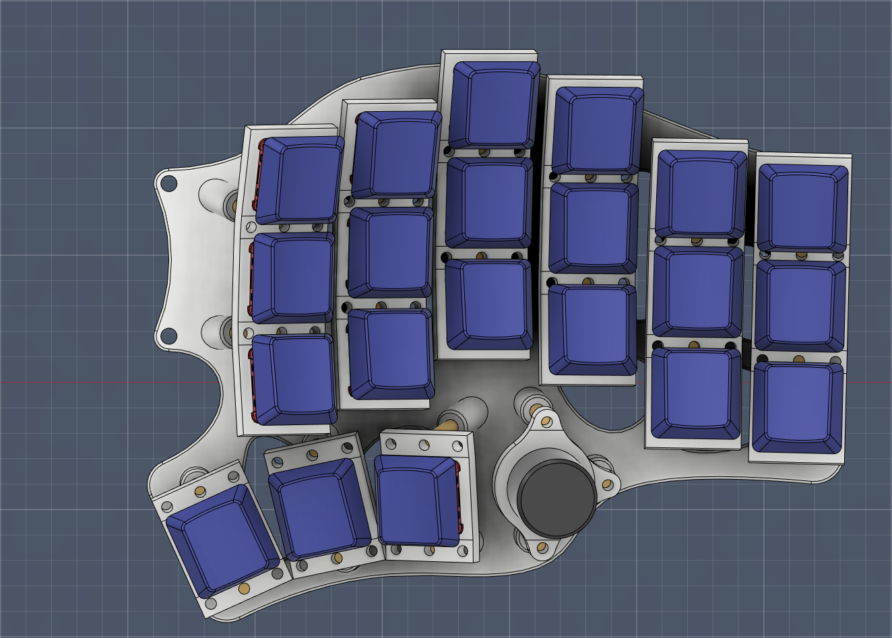

# Mag-Wave44

- 中文說明（Chinese Readme）。
- [英文說明（English Readme）](readme_en.md)。

## 簡介

Dactyl Manuform系列的鍵盤有很多種不同的樣式、也有各式各樣的作者製作成屬於自己的曲面分離式鍵盤，但大部分的Manuform系列根據的都是原始的模型再製而成，而這些成品也不一定適合自己的雙手。而在手指長度上，無名指是屬於比較特殊的一根手指，長度介於中指跟食指之間、又或者跟食指一樣長、而又或者比食指要短都有可能，這就導致大部分的鍵盤設計在無名指上不是那麼的友好。

而我本人的手屬於無名指長介於中指及食指之間，因此根據我的雙手及原始的Dactyl Manuform設計了第一把曲面分離式鍵盤，並且使用矮軸降低鍵盤的厚度，而這把鍵盤卻有著十分難操作移動手指的致命缺失。

於是我根據這個失敗的模型重新再設計了一個模型，以iPhone用戶的外殼配件Mag-Safe及波浪（Wave）狀的外殼底板，再根據44鍵的按鍵總數，將這把鍵盤取名為Mag-Wave44。

- 第一把鍵盤模型。

- 我的左手手指長度。

## 材料清單

### 3D列印部件

|名稱|數量|備註|照片|
|---|---|---|---|
|底板|1組|左右手||
|定位板|1組|左右手||
|旋鈕定位板|1-2片|-||
|`D型`旋鈕帽|1-2個|-||

### 電路板

|名稱|數量|備註|正面|背面|
|---|---|---|---|---|
|單格電路板|42片|`矮軸`用|||
|TRRS、EC-11的專用電路板|1-2片|-|||
|MCU本體電路板|1組|-|||

### 螺絲零件

|名稱|數量|備註|
|---|---|---|
|微型控制器|2片|`ProMicro`系列或`RP2040-zero`系列|
|`1N4148` 二極體|44個|`DO-35`或`SOD-123`都可|
|`TRRS`座|2個|-|
|`M2x5mm` 扁頭螺絲|84根|-|
|`M2x8mm` 扁頭螺絲|18根|可選配，有電路板才需要|
|`M2` 六角螺母|18個|可選配，有電路板才需要|
|`M2x5mm` 雙通銅柱|16根|-|
|`M2x7mm` 雙通銅柱|8根|-|
|`M2x10mm` 雙通銅柱|6根|旋鈕零件，可選配|
|`M2x12mm` 雙通銅柱|8根|-|
|`M2x18mm` 雙通銅柱|4根|-|
|`D型` `EC-11` 旋鈕編碼器|1-2個|`高15mm`，可選配|
|`M5x8mm` 以上厚頭螺絲|4根|Tending用，可選配|
|`M5` 六角螺母|4-7個|Tending用，可選配|
|電線或漆包線|-|-|
|矮軸|42個|-|
|1u鍵帽|42個|-|

> **Note**
>
> 可使用的微型控制器請依據自身需求做選擇，因為是完全開源的關係，你可以任意變更目前使用的GPIO腳位，如果想要按照現有韌體組裝安裝鍵盤的話，以下微型控制器是我納入清單內的，供大家參考：
> 
> ATMega32U4系列：`ProMicro 5V16M`、`Eltie-C v4`。
> 
> RP2040系列：`RP2040-ProMicro`、`RP2040-Zero`、`RP2040-Matrix`、`RP2040-SuperMini`。

## 製作前準備

> **Note**
>
> Mag-Wave44為3D列印的曲面鍵盤，由於定位板在設計上專屬於矮軸，螺絲配件屬於比較小的M2規格，推薦使用LCD或SLA的列印機製作。

> **Note**
>
> 推薦使用工程用樹脂進行列印，確保鍵盤部件不會輕易斷裂及融化。

> **Note**
>
> 鍵盤韌體有3種可供選用，製作方式會以降低手拉線的難易度去介紹。

> **Warning**
>
> 個人操作3D列印機、使用電烙鐵工具等務必注意環境通風，避免中毒、火源、燒燙傷等危險。

- [點我進入組裝說明](guide.md)。

## 參考及使用資料
- [QMK Firmware](https://qmk.fm/).
- [VIAL](https://get.vial.today/).
- [KiCAD](https://www.kicad.org/) version `7.0.5.`
- [JLCPCB](https://jlcpcb.com/).
- [DeepL](https://www.deepl.com/translator).
- [AutoDesk Fusion360](https://www.autodesk.com/products/fusion-360/free-trial).