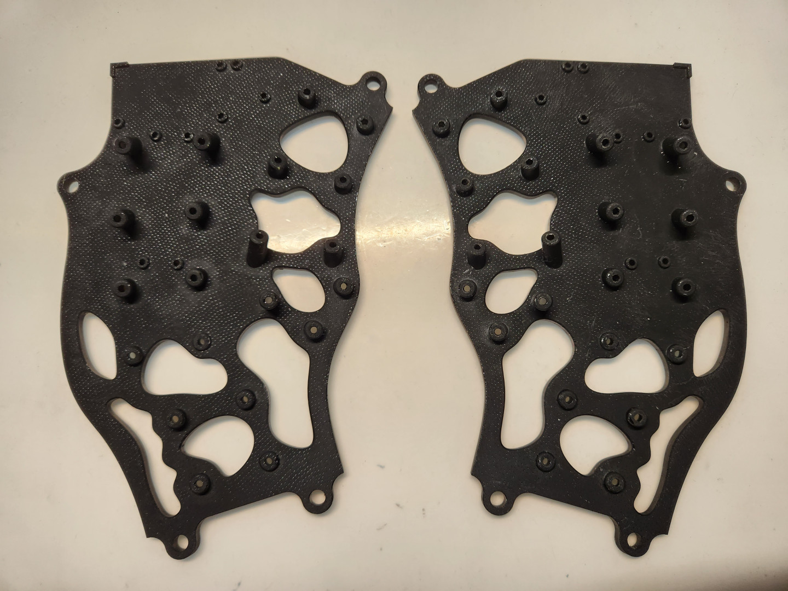
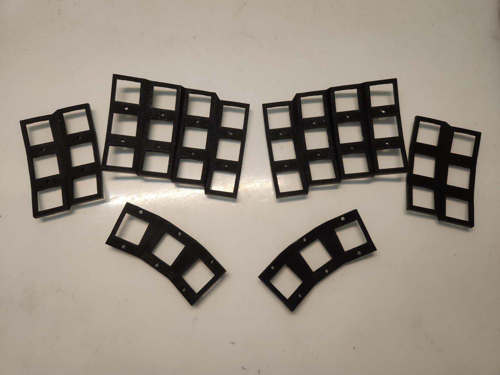
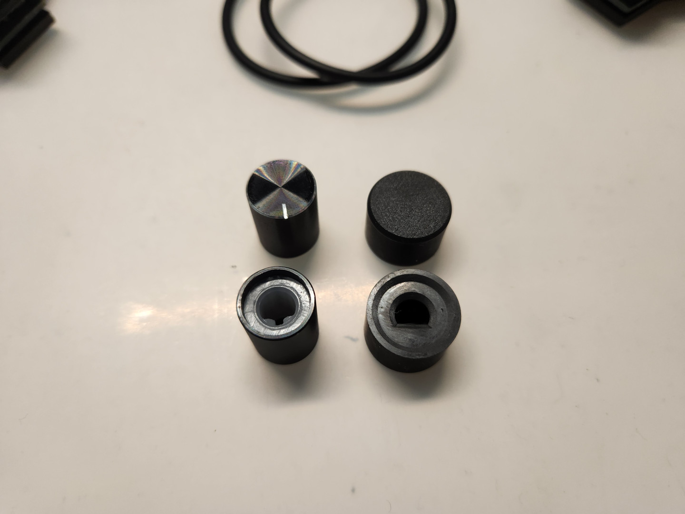
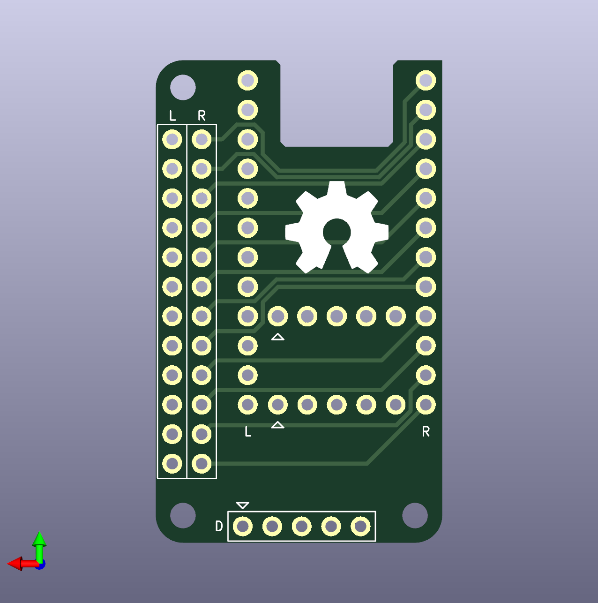
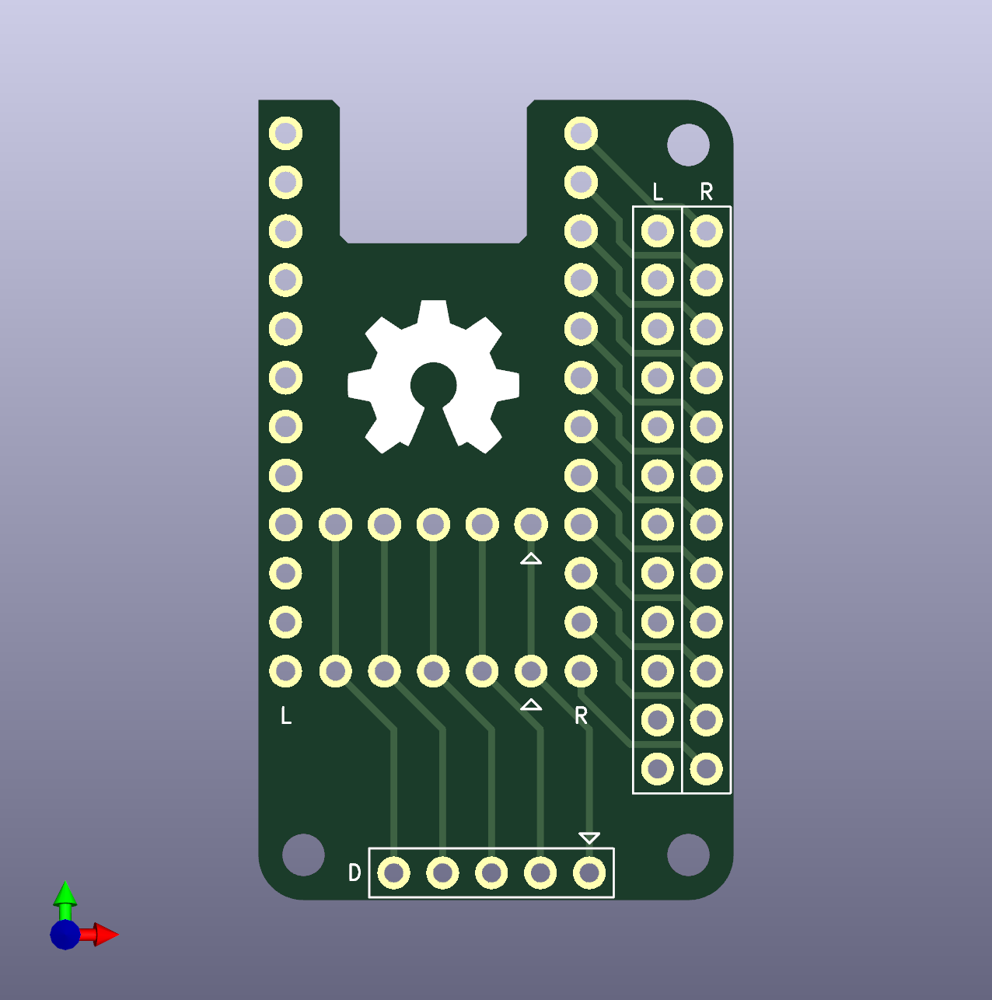
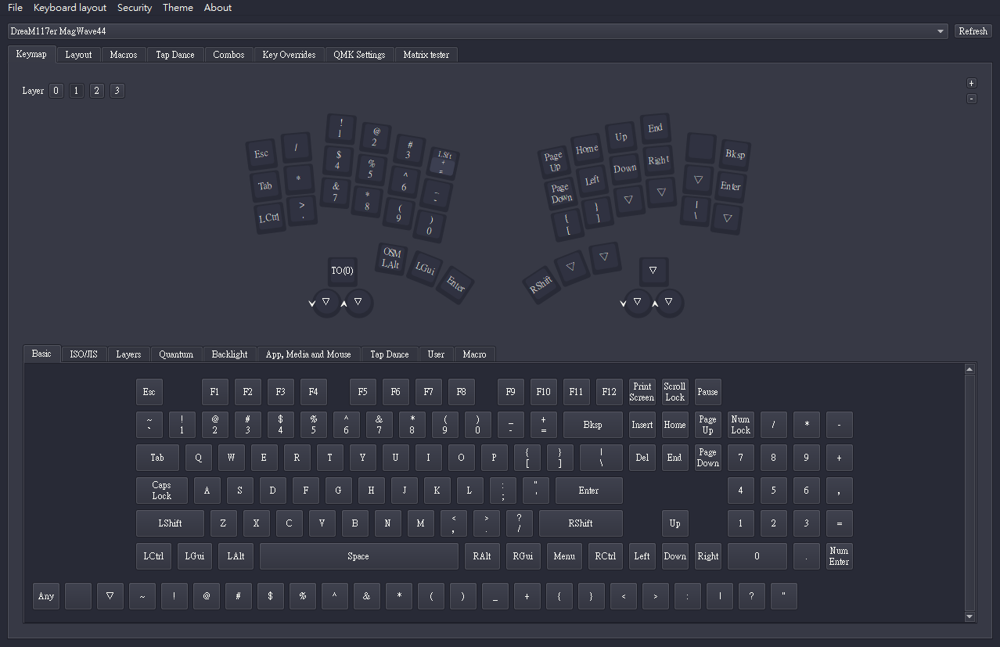
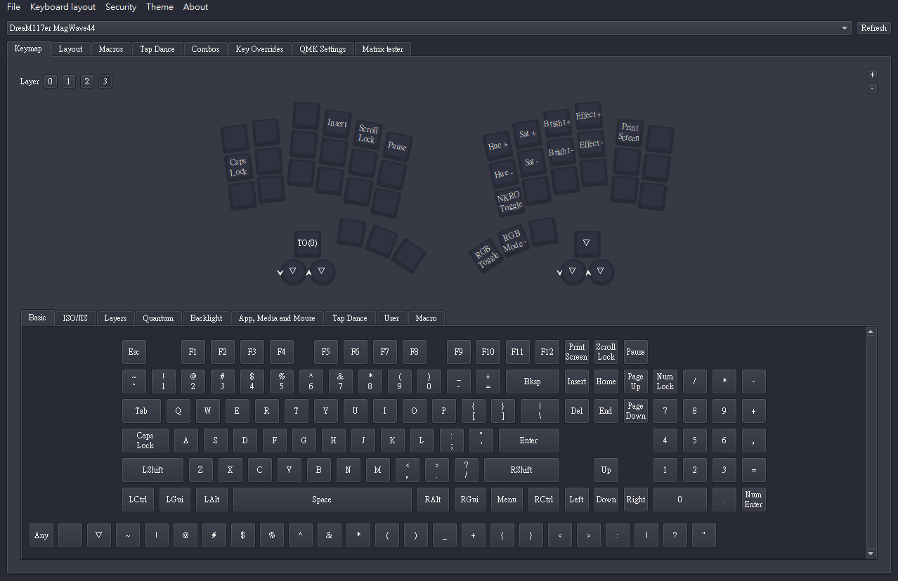

# MagWave44

- [中文說明（Chinese Readme）](readme.md)。
- 英文說明（English Readme）。

## Descruption

Dactyl Manuform keyboards come in many different styles, and various authors have created their own curved split keyboards, but most of the Manuforms are based on the original model, and the finished product may not necessarily fit your hands. In terms of finger length, the ring finger is a special finger, it can be between the middle finger and the index finger, or as long as the index finger, or shorter than the index finger, which makes most of the keyboards designed for the ring finger not so friendly.

As I have a hand with the length of the ring finger between the middle finger and the index finger, I designed my first curved split keyboard based on my hands and the original Dactyl Manuform, and used low profile switches to reduce the thickness of the keyboard, which had the fatal flaw of being very difficult to maneuver with a moving finger.

So I redesigned a new model based on this failed model, using the iPhone user's case accessory Magsafe and a wave-like base plate, and named the keyboard MagWave44 based on the total number of 44 keys.

- The first keyboard model.

- My left hand fingers.

## Lists

### 3D Printed

|Item|Amount|Note|photo|
|---|---|---|---|
|bottom|1|Both hand||
|plate|1|Both hand||
|ec-11 plate|1-2|-||
|`D type` EC-11 caps|1-2|-||

### PCBs

|Item|Amount|Note|Top|Bottom|
|---|---|---|---|---|
|Single PCB|42|for `low profile` switches|||
|PCB for TRRS|1-2|-|||
|PCB for EC-11|1-2片|-|||
|Main PCBs|2|-|||
|Body PCBs|2|-|||

### Screws and Others

|Item|Amount|Note|
|---|---|---|
|MCU|2|`ProMicro` or `RP2040Zero` series|
|Diodes `1N4148`|44|Choose one type of `DO-35` or `SOD-123`|
|`TRRS` jack|2|-|
|M/F `Pin headers`|-|-|
|`M2x5mm` Screw|84|-|
|`M2x8mm` Screw|18|Optional, if it have PCBs|
|`M2` Nut|18|Optional, if it have PCBs|
|`M2x5mm` Spacer|16|-|
|`M2x7mm` Spacer|8|-|
|`M2x10mm` Spacer|6|Optional, for rotray encoder|
|`M2x12mm` Spacer|8|-|
|`M2x18mm` Spacer|4|-|
|`D type` Rotray Encoder `EC-11`|1-2|`15mm high`, Optional|
|`M5x8mm` or more lenth thick head Screw|4|Tending, Optional|
|`M5` Nut|4-7|Tending, Optional|
|Wire|-|-|
|Switches|42|-|
|1u Keycaps|42|-|

> **Note**
>
> The micro controller can be used according to your own needs. Please choose the micro controller according to your own needs, because it is completely opensource, you can change the current GPIO pins, if you want to install the keyboard according to the existing firmwares, the following micro controller is included in my list for your reference:
> 
> ATMega32U4 series: `ProMicro 5V16M`, `Eltie-C v4`.
> 
> RP2040 series: `RP2040-ProMicro`, `RP2040-Zero`, `RP2040-Matrix`, `RP2040-SuperMini`.

## Preparation

> **Note**
>
> MagWave44 is a curved surface keyboard for 3D printing. Since the positioning plate is designed to belong to the short axis, the screw fittings belong to the smaller M2 specification, and it is recommended to use LCD or SLA printers for production.

> **Note**
>
> It is recommended to use engineering resin for printing to ensure that the keyboard parts will not break and melt easily.

> **Note**
>
> There are 4 types of keyboard firmware to choose from, and the production method will be introduced in such a way as to reduce the difficulty of handwiring.

> **Warning**
>
> Individuals operating 3D printers and using soldering iron tools must pay attention to the ventilation of the environment to avoid poisoning, ignition sources, burns and other hazards.

- Click the link to [Building Guide](guide_en.md)。

## Layout and Keymap

## Reference and Information

- [QMK Firmware](https://qmk.fm/).
- [VIAL](https://get.vial.today/).
- [KiCAD](https://www.kicad.org/) version `7.0.5.`
- [JLCPCB](https://jlcpcb.com/).
- [DeepL](https://www.deepl.com/translator).
- [AutoDesk Fusion360](https://www.autodesk.com/products/fusion-360/free-trial).